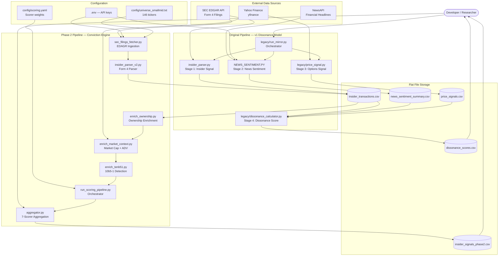
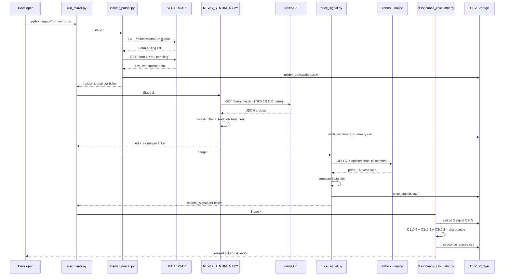
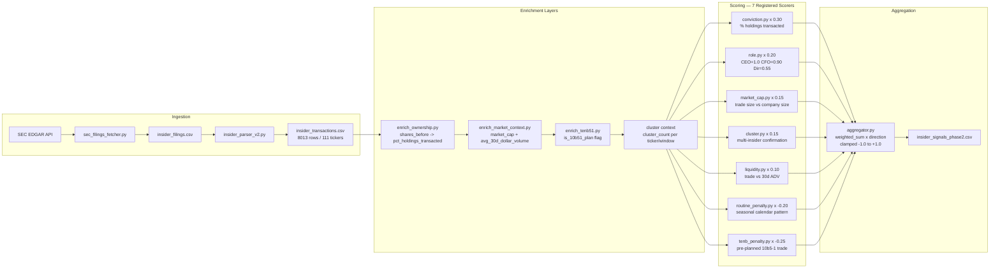
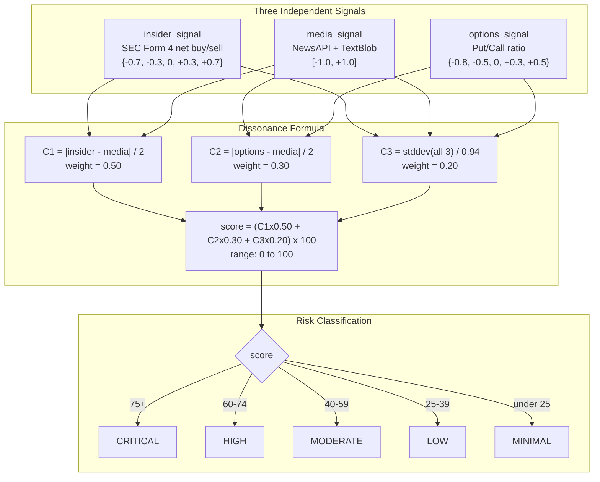
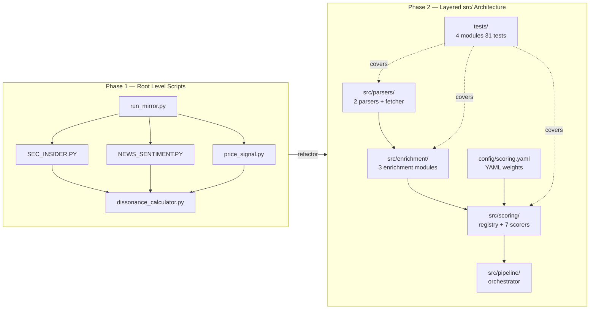

# MIRROR — System Architecture

**Version:** Phase 2 (June 2026)
**Stack:** Python 3.13, pandas, yfinance, TextBlob, SEC EDGAR API, NewsAPI

---

## Overview

MIRROR is a quantitative insider signal research platform. It operates two independent pipelines:

1. **Original Pipeline (v1)** — cognitive dissonance model: measures contradiction between insider activity, news sentiment, and options market positioning across 10 megacap tickers.
2. **Phase 2 Pipeline** — multi-factor insider conviction scoring across 111 small/mid-cap tickers, with enrichment layers, a scorer registry, and YAML-driven weights.

---

## A. High-Level Architecture



---

## B. Original Pipeline — Request Lifecycle



---

## C. Phase 2 Pipeline — Data Flow



---

## D. Cognitive Dissonance Model — Feature Flow



---

## E. Before vs After — Architecture Change



---

## F. Scorer Registry Pattern

```mermaid
flowchart TD
    subgraph REGISTER["Registration — import time"]
        R1[conviction.py] -->|@register_scorer| R[SCORER_REGISTRY dict]
        R2[role.py] -->|@register_scorer| R
        R3[market_cap.py] -->|@register_scorer| R
        R4[cluster.py] -->|@register_scorer| R
        R5[liquidity.py] -->|@register_scorer| R
        R6[routine_penalty.py] -->|@register_scorer| R
        R7[tenb_penalty.py] -->|@register_scorer| R
        R8[__init__.py imports all] --> R1 & R2 & R3 & R4 & R5 & R6 & R7
    end

    subgraph USE["Usage — per transaction row"]
        R --> AGG[aggregator.py\naggregate(row, config)]
        YAML[config/scoring.yaml] --> AGG
        AGG -->|for each enabled scorer| CALL[scorer_fn(row) x weight]
        CALL --> SUM[weighted_sum]
        SUM --> DIR["x direction — BUY=+1 SELL=-1"]
        DIR --> CLAMP[clamp to -1.0..+1.0]
        CLAMP --> OUT[conviction_signal]
    end
```

---

## Folder Structure

```
MIRROR/
├── src/                          # Phase 2 production code
│   ├── parsers/
│   │   ├── sec_filings_fetcher.py    # EDGAR API -> insider_filings.csv
│   │   ├── insider_parser_v2.py      # Form 4 XML parser (production)
│   │   └── universe.py               # Ticker -> CIK resolver
│   ├── enrichment/
│   │   ├── enrich_ownership.py       # shares_before + pct_holdings_transacted
│   │   ├── enrich_market_context.py  # yfinance market cap + ADV
│   │   └── enrich_tenb51.py          # 10b5-1 plan detection
│   ├── scoring/
│   │   ├── registry.py               # @register_scorer decorator
│   │   ├── aggregator.py             # Weighted aggregation + explain()
│   │   ├── conviction.py             # % holdings transacted (weight: 0.30)
│   │   ├── role.py                   # Role weight map (weight: 0.20)
│   │   ├── market_cap.py             # Market cap normalized (weight: 0.15)
│   │   ├── cluster.py                # Multi-insider detection (weight: 0.15)
│   │   ├── liquidity.py              # Trade vs ADV (weight: 0.10)
│   │   ├── routine_penalty.py        # Calendar seasonality (weight: -0.20)
│   │   └── tenb_penalty.py           # Pre-planned trades (weight: -0.25)
│   └── pipeline/
│       └── run_scoring_pipeline.py   # Phase 2 main entry point
├── config/
│   ├── scoring.yaml                  # Scorer weights (tune without code changes)
│   └── universe_smallmid.txt         # 146-ticker curated universe
├── tests/
│   ├── test_conviction.py            # 15 tests
│   ├── test_cluster.py               # 5 tests
│   ├── test_10b51_extraction.py      # 7 tests
│   └── test_entity_filer.py          # 4 tests
├── legacy/                           # Archived Phase 1 code (reference only)
│   ├── run_mirror.py
│   ├── dissonance_calculator.py
│   ├── price_signal.py
│   └── insider_parser.py
├── data/                             # Input data (gitignored)
│   ├── insider_transactions.csv      # 8013 transactions, 111 tickers
│   └── ...
├── results/                          # Output data (gitignored)
│   ├── insider_signals_phase2.csv    # Phase 2 scored output
│   └── dissonance_scores.csv         # Phase 1 dissonance output
├── scripts/                          # Developer utilities
├── docs/                             # Documentation
├── NEWS_SENTIMENT.PY                 # Active - Phase 1 Stage 2
├── insider_parser.py                 # v1 parser (deprecated root-level copy)
├── .env                              # Secrets (gitignored)
└── requirements.txt                  # numpy, pandas, requests, textblob, yfinance
```

---

## Key Design Decisions

| Decision | Rationale |
|---|---|
| Registry pattern for scorers | New scorer = one decorated file, zero changes to aggregator |
| YAML-driven weights | Analysts can A/B test without touching Python code |
| Flat CSV storage (no database) | Matches research workflow; SQLite upgrade planned for Phase 3 |
| Enrichment as separate layer | Keeps parsers pure; enrichment can be retried independently |
| Graceful degradation on None | Conviction scorer returns 0.0, not crash, on missing ownership data |
| Hard-gate for entity filers | Prevents non-discretionary institutional trades from polluting signals |
| is_company via XML tag + name fallback | XML tag is authoritative for modern filings; fallback covers pre-2023 filings |
