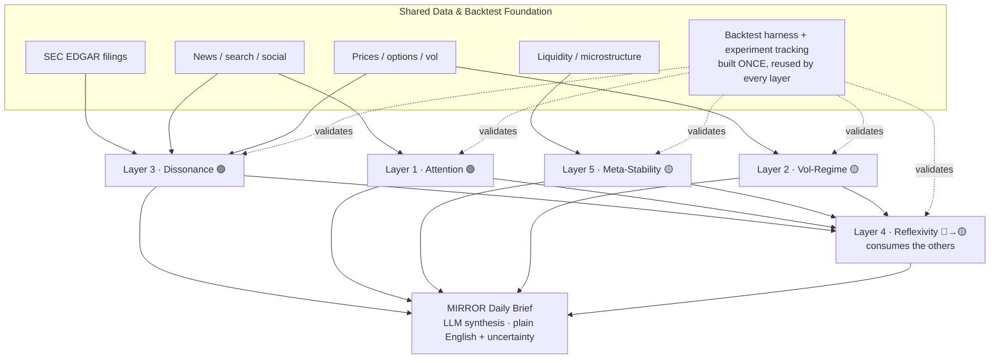
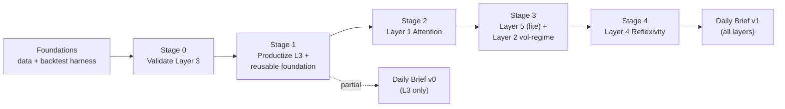

# MIRROR — Whole-Project Vision Roadmap (North Star)

**Version:** 0.1 (draft for review) | **Date:** June 21, 2026 | **Author:** devdiv07
**Stance:** Honest engineering translation — ambition preserved, claims graded, metaphor separated from signal.

---

## What this document is (and is not)

There are three distinct things in this project, and they are easy to confuse:

| | What it is | Where it lives | Status |
|---|---|---|---|
| **The MIRROR vision** | The full 5-layer system from the founding prompt | This document | North star — mostly unbuilt |
| **The current component** | Layer 3 only: the Cognitive Dissonance Mapper | `legacy/` (the product) + `src/` (rebuilt insider leg) | In progress |
| **The component roadmap** | How to harden + validate Layer 3 | [implementation_plan.md](../implementation_plan.md), [docs/roadmap.md](roadmap.md) | Already written |

> **This document is the missing one.** It is the roadmap for the *whole MIRROR project* — how a single partially-built component becomes the full system. It does **not** replace the component roadmap; it sits above it. When this doc says "validate Layer 3," the *how* lives in `docs/roadmap.md`.

This is a **draft for iteration**. Once the content is agreed, it becomes the polished institutional HTML/PDF report.

---

## 1. Where MIRROR actually is today

Stated plainly, with no inflation:

- The full vision is **five analytical layers + a synthesis output** (the Daily Brief).
- You are building **Layer 3** (Cognitive Dissonance Mapper) — which the vision itself correctly names as "What You Can Build Right Now."
- Layer 3 has **three legs**: insider activity (what they *do*), media sentiment (what they *say*), options/price (what smart money does *quietly*). A "brain" ([legacy/dissonance_calculator.py](../legacy/dissonance_calculator.py)) combines them into a 0–100 dissonance score.
- Of those three legs, **only the insider leg has been seriously rebuilt** — into the `src/` conviction engine (7 scorers, registry, YAML weights, 31 passing tests). The other two legs are in original `legacy/` form. The brain still uses manually-chosen, un-backtested weights.
- The rebuilt insider leg is **not yet reconnected** to the brain; its output (`results/insider_signals_phase2.csv`) is currently consumed by nothing.

**Honest one-line status: ~40% of one leg of one of five layers is solid.** Everything else is either prototype-grade (the other two legs + the brain) or unbuilt (Layers 1, 2, 4, 5, and the Daily Brief).

This is not a criticism — it's the correct starting point. The roadmap's job is to make the remaining 95% deliberate instead of accidental.

> **Full Layer 3 current-state analysis** — the completion breakdown, the actual backtest results (which *exist* and are **inconclusive**, not absent), what the June-19 reports flagged that is now resolved, and the prioritized remaining work — lives in **[layer3_current_state.md](layer3_current_state.md)**. Short version: the insider leg is built but **unvalidated and not yet wired into the dissonance score**, and the one backtest that ran is encouraging on the plan-vs-opportunistic split but fails on sample size, the largest bucket, and a total lack of buy-side data.

---

## 2. The Reality Grade — all 5 layers, honestly

Every layer is graded as one of:

- **🟢 Signal** — maps to real data, the underlying effect has academic or empirical support, and it is *falsifiable* (you can prove it works or doesn't).
- **🟡 Model** — legitimate quantitative discipline, but hard, judgment-heavy, and/or data-expensive.
- **🔴 Metaphor** — the vision's framing is poetic, not literal. A real effect may hide underneath, but the stated mechanism is not true and must be re-specified before it's built.

| Layer | Vision name | Reality grade | Real mechanism underneath | Falsifiable? | Solo difficulty |
|---|---|---|---|---|---|
| **3** | Cognitive Dissonance Mapper | 🟢 Signal | Gap between insider/options behaviour and media narrative | Yes (IC vs forward returns) | **In progress** |
| **1** | Collective Attention Topology | 🟢 Signal | Investor (in)attention → mispricing; attention is measurable | Yes (low-attention basket returns) | Medium |
| **5** | Meta-Stability Index | 🟡 Model | Market-microstructure / systemic-risk metrics (liquidity, breadth) | Partly (few crisis episodes) | Medium (lite) / Hard (full) |
| **2** | Emotional Physics Engine | 🔴 Metaphor → 🟡 Model | Volatility clustering & regime; **not** "conservation of energy" | Weakly (vol timing is hard) | Easy to build, hard to profit |
| **4** | Reflexivity Cascade Simulator | 🔴 Metaphor → 🟡 Model | Cross-asset contagion / regime simulation; needs a *validated* dynamics model first | Hard (tiny crisis sample) | Hard |
| Out | MIRROR Daily Brief | 🟢 Buildable now | LLM synthesis of structured layer outputs into plain English | N/A (presentation) | Easy — *but only as good as its inputs* |

### Layer-by-layer detail

**Layer 3 — Cognitive Dissonance Mapper · 🟢 Signal · YOU ARE HERE**
The strongest part of the vision because every input is real and free: insider Form 4 filings, options put/call, news sentiment. The "trapped knowing resolves violently" thesis is the academically-supported insider-information + limited-arbitrage story. *Verdict:* correct first build. Its validity is entirely a backtesting question, which is exactly what the component roadmap addresses.

**Layer 1 — Collective Attention Topology · 🟢 Signal**
"What is the market ignoring?" is measurable and backed by real research (investor inattention, limited-attention anomalies, the FEARS index). Attention proxies: news volume (NewsAPI/GDELT), search interest (Google Trends), social mentions (Reddit/StockTwits), analyst coverage counts, options/volume concentration. The hard part is honestly defining the topic universe and a concentration metric (e.g. a Herfindahl index of attention). *Verdict:* the second-most-buildable layer and a genuine edge candidate. Shares the news infrastructure Layer 3's media leg already needs.

**Layer 5 — Meta-Stability Index · 🟡 Model**
"Probability the market stops functioning" is a real field (systemic risk: SRISK, CoVaR, Amihud illiquidity, market breadth). Components split by cost: *cheap/free* (Amihud illiquidity from daily data, breadth/participant Herfindahl from volume, realized-vol regime) vs *expensive* (order-book depth, TAQ, market-maker inventory). *Verdict:* buildable in a credible "lite" form on free data; the institutional-grade version needs paid microstructure data. Validate against the handful of known liquidity events (Feb 2018, Mar 2020).

**Layer 2 — Emotional Physics Engine · 🔴 Metaphor → 🟡 Model**
This is the layer that most needs honesty. "Conservation of emotional energy" is **not a real law** — there is nothing being conserved, and the thermodynamic framing is a metaphor. The genuine effect underneath is **volatility clustering and mean reversion**: low-vol regimes do tend to precede vol expansion (the "vol squeeze"). But the *timing* of discharge is largely unpredictable, and this effect is heavily arbitraged (it's literally what VIX products trade). *Verdict:* build it as honest vol-regime modelling (realized-vol percentile + duration, vol-of-vol, VIX/VVIX term structure, GARCH/HAR, regime-switching HMM), **drop the physics language entirely**, and expect modest, well-known results. Lowest-priority of the buildable layers.

**Layer 4 — Reflexivity Cascade Simulator · 🔴 Metaphor → 🟡 Model**
Soros-style reflexivity is real *conceptually* but extremely hard to model quantitatively. The vision's "94% of scenarios: dollar strengthens" figures are **illustrative/fabricated** — a real version requires a *validated cross-asset dynamics model* (the part the vision hand-waves) before any Monte Carlo means anything. It also structurally *depends on the other layers* — it simulates how dissonance/attention/instability propagate. *Verdict:* build **last**, treat as a research bet, and be ruthlessly skeptical: it is the layer most likely to produce confident-looking nonsense.

**Output — MIRROR Daily Brief · 🟢 Buildable now (but credibility is borrowed)**
The vision's "living document that reads like the most intelligent analyst alive" is, in 2026 terms, an **LLM synthesis layer**: feed the structured outputs of the validated layers to a strong model (e.g. Claude Opus 4.8 for depth, or a faster Claude model for hourly runs) and have it write the brief with explicit confidence levels. This is very buildable today. **The trap:** an LLM will write an eloquent, authoritative brief on top of *garbage signals just as happily as good ones* — note the founding prompt's own sample brief contains made-up percentages. The brief must be hard-constrained to report only validated layer outputs and their uncertainty, and to never invent a number. *Verdict:* build it incrementally (start with just Layer 3), and treat its eloquence as a liability to be managed, not a feature.

---

## 3. Re-specifying the speculative layers into testable math

The "honest translation" deliverable, concretely. For each soft layer: the false claim → the real, falsifiable specification.

**Layer 2 — from "emotional thermodynamics" to vol-regime modelling**
- ❌ Claim: emotional energy is conserved; compression duration predicts discharge magnitude (2.3×).
- ✅ Spec: features = realized-vol percentile (rank vs trailing 1–3y), low-vol regime *duration*, vol-of-vol, VIX & VVIX term-structure slope. Model = regime-switching (HMM) or HAR-RV.
- ✅ Falsifiable test: does compression duration predict subsequent realized-vol *magnitude* out-of-sample? (Honest prior: weak. Vol level is predictable; spike *timing* mostly isn't.)

**Layer 4 — from "10,000 Monte Carlo cascades" to validated contagion model**
- ❌ Claim: simulate feedback loops, report "common paths" with precise probabilities.
- ✅ Spec: (1) estimate a cross-asset response model (VAR / network of conditional correlations / regime transitions) on history; (2) *validate it out-of-sample first*; (3) only then simulate shocks through the validated model.
- ✅ Falsifiable test: do the simulator's "common paths" match realized crisis propagation on held-out episodes? (Honest prior: tiny sample of crises → very hard to validate; high overfitting risk.)

**Layer 5 — from "meta-stability" to a measurable fragility index**
- ❌ Claim: single 0–100 "probability the market breaks."
- ✅ Spec (lite, free data): composite of Amihud illiquidity, breadth/volume Herfindahl, realized-vol regime, credit-spread proxy. (full: + order-book depth, MM inventory.)
- ✅ Falsifiable test: does the index rise *before* known liquidity events, not just during them?

**Layer 1 — from "attention topology" to an attention-concentration signal**
- ❌ Vague: "340% more systemic risk in ignored variables."
- ✅ Spec: per-ticker/theme attention score (news + search + social + coverage), normalized; concentration = Herfindahl across themes; per-name "neglect" = low attention relative to fundamentals/size.
- ✅ Falsifiable test: does a low-attention basket earn abnormal returns vs a high-attention basket, controlling for size/value?

---

## 4. How the layers fit together as one system

Two structural truths from this picture:

1. **Layer 4 is downstream of everything** — it simulates how the other layers' states propagate. Build it last.
2. **The Daily Brief can start early and grow** — it can narrate Layer 3 alone today, then absorb each layer as it validates.

---

## 5. Build order & dependencies

The non-negotiable principle (see §7): **a layer is not built until the previous one passes its validation gate.** Sequencing is by *buildability and dependency*, not by how exciting a layer sounds.

---

## 6. The staged roadmap

Timelines are **estimates for a part-time solo developer**, not commitments. Effort sizes: S (days), M (weeks), L (months), R (open-ended research bet).

### Stage 0 — Validate Layer 3 *(now; gate for the entire project)*
| Item | Effort | Detail |
|---|---|---|
| Reconnect `src/` insider engine → dissonance brain | M | Replace crude `calculate_insider_signals()` with the conviction signal |
| Rebuild media & options legs to `src/` standard | M | Bring legs 2 & 3 out of `legacy/` |
| Backtest the dissonance score vs forward returns | M | This is the *how* in [docs/roadmap.md](roadmap.md) Phase 4 |
| **GATE** | — | **Dissonance score shows IC > 0.05 out-of-sample (or fix it). If Layer 3 has no edge, the whole vision is in question — so this gate matters more than any other.** |

### Stage 1 — Productize Layer 3 + build the reusable foundation
| Item | Effort | Detail |
|---|---|---|
| Shared data layer | M | One place to fetch/cache/snapshot filings, prices, news (used by all future layers) |
| Shared backtest + experiment harness | M | Built once, reused by every layer — avoids re-writing validation 5 times |
| Daily Brief v0 (Layer 3 only) | M | LLM synthesis, hard-constrained to validated outputs + uncertainty |
| **Don't build yet** | — | Layers 1/2/4/5; any dashboard; any paid data |

### Stage 2 — Layer 1: Attention Topology 🟢
| Item | Effort | Detail |
|---|---|---|
| Attention data ingestion | M | News volume, Google Trends, social mentions, coverage counts |
| Attention-concentration + neglect signal | M | Herfindahl + per-name neglect score |
| **GATE** | — | Low-attention basket shows abnormal return vs high-attention, controlled for size |

### Stage 3 — Layer 5 (lite) + Layer 2 vol-regime 🟡
| Item | Effort | Detail |
|---|---|---|
| Meta-Stability (free-data version) | M | Amihud, breadth Herfindahl, vol regime, credit proxy |
| Vol-regime model (Layer 2, honest) | M | Realized-vol percentile/duration, VIX/VVIX term structure, regime HMM |
| **GATE** | — | Each must beat a naive baseline on its own falsifiable test, or it ships as "context only," never as alpha |

### Stage 4 — Layer 4: Reflexivity Simulator 🔴→🟡 *(research bet)*
| Item | Effort | Detail |
|---|---|---|
| Cross-asset dynamics model | L–R | VAR / correlation-network / regime transitions |
| Validate model out-of-sample *before* simulating | L | Mandatory — no simulation on an unvalidated model |
| Cascade Monte Carlo + Daily Brief v1 | L | Only if the dynamics model validates |
| **GATE** | — | Simulated "common paths" match realized crisis propagation on held-out episodes |

---

## 7. Cardinal rules (the "dead serious" guarantees)

These exist to stop MIRROR from becoming an eloquent fiction:

1. **No number reaches output without a backtest.** Every weight, threshold, and band is either learned from data or labelled "heuristic, unvalidated." (This is the exact problem that birthed `implementation_plan.md`.)
2. **No layer advances until it passes its falsifiability gate.** A layer that can't be proven right or wrong is *context*, never *signal*, and is labelled as such.
3. **The Daily Brief may only state validated outputs and their uncertainty.** It must never invent a figure — the founding prompt's own sample brief broke this rule, and that is the failure mode to engineer against.
4. **Metaphor is never sold as mechanism.** "Emotional physics" ships as "volatility-regime model," explicitly.
5. **Build narrow, validate, then widen.** One validated layer beats five half-built ones.

---

## 8. Whole-project risk register

| Risk | Likelihood | Severity | Mitigation |
|---|---|---|---|
| Signal layers have no real alpha (esp. L3) | Medium–High | Critical | Stage 0 gate before anything else; kill or fix on failure |
| Speculative layers (L2/L4) are unfalsifiable in practice | High | High | Re-spec to falsifiable form; ship as "context only" if they can't be validated |
| Solo bandwidth → five layers half-finished | High | High | Strict stage gates; never start Layer N+1 with Layer N unvalidated |
| Data cost wall (L5 full, deep options for L3) | Medium | Medium | Free-data "lite" versions first; pay only after a layer proves out |
| Daily Brief eloquence masks weak inputs | Medium | High | Cardinal rule #3; show confidence + provenance on every claim |
| Look-ahead / survivorship bias in backtests | Medium | High | Universe lock + data snapshots (already in `implementation_plan.md`) |
| Over-building before validation | High | High | This entire document is the mitigation |

---

## 9. The immediate next step

The grand roadmap does **not** change what you do next — it gives it meaning. The whole project is gated on **Stage 0: prove Layer 3 has predictive value.** Until the dissonance signal backtests, building Layers 1–5 is building on sand.

A first backtest already ran and is **inconclusive** (see [layer3_current_state.md](layer3_current_state.md) §5), so the very next action is sharper than "just backtest": **turn the notebook backtest into a reproducible `backtester.py` that measures real IC with buy-side data, then — only if it clears the gate — reconnect the `src/` insider engine to the dissonance brain.** This north-star document's main contribution is the discipline around it: *don't touch Layers 1, 2, 4, or 5 until Layer 3 earns it.*

---

## Appendix — data sources per layer

| Layer | Free / cheap | Expensive (later) |
|---|---|---|
| 3 Dissonance | SEC EDGAR (filings), NewsAPI/GDELT (media), yfinance (price/options proxy) | Paid options flow, earnings-call transcripts |
| 1 Attention | Google Trends, Reddit/StockTwits, news volume, SEC full-text search | Paid social/altdata feeds |
| 5 Meta-Stability | Amihud (daily data), volume breadth, vol | Order-book depth, TAQ, MM inventory |
| 2 Vol-Regime | yfinance vol, VIX/VVIX (public) | Intraday vol, full options surface |
| 4 Reflexivity | Cross-asset daily returns, credit-spread proxies | Real-time cross-asset, FX microstructure |
| Brief | Claude API (synthesis) | Higher-tier model usage at hourly cadence |

---

*Draft v0.1 — for review. Once agreed, this becomes the polished institutional HTML/PDF report (matching the existing two in `docs/`).*
