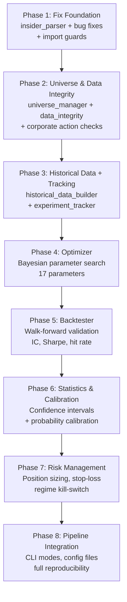

# MIRROR: Institutional-Grade Overhaul — Complete Plan

> **Phase numbering note (added June 2026):** This document was written before Phase 2 (the conviction engine) was shipped. Its internal "Phase 2–8" labels refer to *future roadmap work*, not the already-delivered Phase 2. To avoid confusion with the shipped phases, the canonical numbering for future work is **Phase 3 onwards** — as documented in [docs/roadmap.md](docs/roadmap.md). The features described here map as: this doc's Phase 2 → Roadmap Phase 4, Phase 3 → Roadmap Phase 4, Phase 4 → Roadmap Phase 4 (optimizer), Phase 5 → Roadmap Phase 4 (backtester), Phase 6–7 → Roadmap Phase 4 (statistics + risk), Phase 8 → Roadmap Phase 3/5 (pipeline integration).

---

## The Core Problem

Every number in MIRROR is your opinion, not market truth. Beyond the manual weights, the system also lacks the **infrastructure controls** that separate a toy from an institutional tool. This plan fixes both.

---

## Full Audit: Current Codebase Problems

### 🔴 Hardcoded Weights & Thresholds (17 parameters)

| File                       | Line    | Value                               | Problem                                           |
| -------------------------- | ------- | ----------------------------------- | ------------------------------------------------- |
| `dissonance_calculator.py` | 80-85   | `ratio > 2 → -0.7`                  | No empirical basis                                |
| `dissonance_calculator.py` | 79      | All activity → selling              | Wrong. Insider buying is strongest bullish signal |
| `dissonance_calculator.py` | 135-144 | P/C thresholds `1.5, 1.2, 0.5, 0.7` | Textbook, not calibrated to this universe         |
| `dissonance_calculator.py` | 202-204 | `W1=0.50, W2=0.30, W3=0.20`         | Most critical numbers — completely made up        |
| `dissonance_calculator.py` | 217-231 | Risk bands `75, 60, 40, 25`         | Zero backtesting behind them                      |
| `NEWS_SENTIMENT.PY`        | 63      | `MIN_RELEVANCE_SCORE = 2`           | Arbitrary                                         |
| `NEWS_SENTIMENT.PY`        | 119-165 | Source tiers `1.5x, 1.0x, 0.7x`     | Reasonable guesses, not validated                 |
| `price_signal.py`          | 46-52   | PV divergence ±0.2                  | Fixed, not volatility-adjusted                    |

### 🔴 Broken Insider Signal

SEC_INSIDER.PY collects Form 4 filings but **never parses buy vs sell**. It counts filings and assumes all activity is selling. This corrupts every downstream output.

### 🟡 Structural Bugs

- `calculate_insider_signals` returns `0` (scalar) on empty data but `(signal, note)` (tuple) with data → **unpacking crash**
- Same bug in `calculate_media_signals` and `calculate_options_signal`
- No `if __name__ == "__main__"` guards → files execute on import → backtesting impossible
- `price_signal.py` line 140: quad-quote `""""` docstring typo
- Lines 64-68 duplicate lines 67-68 in `price_signal.py`
- Return signals (5d, 20d, 60d momentum) collected but **never used**

---

## Assessment of Your 8 Institutional Controls

| #   | Control                    | Priority        | Rationale                                                                                                 |
| --- | -------------------------- | --------------- | --------------------------------------------------------------------------------------------------------- |
| 1   | **Universe bias**          | 🔴 CRITICAL NOW | Without it, your backtest is lying. Survivorship bias alone can add 1-2% annual return that doesn't exist |
| 2   | **Data revision freeze**   | 🟡 IMPORTANT    | yfinance retroactively adjusts data. Snapshot freezing prevents look-ahead bias                           |
| 3   | **Corporate actions**      | 🔴 CRITICAL NOW | A 4:1 split makes a stock look like it crashed 75% if not handled. Corrupts every return calculation      |
| 4   | **Position sizing & risk** | 🟢 PHASE 2      | Only matters once you have a working signal. Don't engineer risk controls around a broken signal          |
| 5   | **Calibration layer**      | 🟢 PHASE 2      | Convert scores → probabilities. Important but depends on having valid backtested scores first             |
| 6   | **Regime kill-switch**     | 🟡 IMPORTANT    | Auto-halt when model performance degrades. Build after backtester exists                                  |
| 7   | **Experiment tracking**    | 🔴 CRITICAL NOW | Without it, you can't reproduce results. Every optimization run becomes throwaway                         |
| 8   | **Uncertainty reporting**  | 🟡 IMPORTANT    | Confidence intervals on metrics. Prevents overconfidence in small-sample results                          |

---

## Proposed Changes — All 8 Phases

### Phase 2: Universe Bias & Corporate Actions Controls

> Prevent your backtest from lying.

---

#### [NEW] [universe_manager.py](file:///c:/Users/ASUS/MIRROR/universe_manager.py)

**Survivorship-bias-free universe management:**

```python
class UniverseManager:
    """Lock the tradable universe at each historical test date.

    Rules:
    1. Only tickers that were actively trading on the test date are included
    2. Delisted tickers are included in historical tests (no ex-post filtering)
    3. Universe is frozen per snapshot — no future additions leak backward
    4. Ticker changes (FB → META) are mapped correctly by date
    """

    def get_universe(self, as_of_date: str) -> list[str]:
        """Return the exact set of tradable tickers as of a specific date."""

    def is_valid_ticker(self, ticker: str, date: str) -> bool:
        """Check if ticker was tradable on this date."""
```

- Maintains a `config/universe_history.json` mapping `date → [tickers]`
- For the current 10-ticker universe this is simple; the infrastructure scales when you add more
- Validates that no backtest uses a ticker before its listing date

#### [NEW] [data_integrity.py](file:///c:/Users/ASUS/MIRROR/data_integrity.py)

**Corporate actions & data freezing:**

```python
class DataIntegrity:
    """Ensure all return calculations are consistent wrt splits/dividends.

    Controls:
    1. Use yfinance adjusted close (auto-handles splits/dividends)
    2. Cross-validate: check that no single-day return exceeds ±50%
       (likely missed split if it does)
    3. Log all detected anomalies for manual review
    """

    def validate_returns(self, price_df) -> dict:
        """Flag suspicious returns that may indicate missed corporate actions."""

    def freeze_snapshot(self, data: dict, snapshot_date: str):
        """Save immutable daily snapshot to data/snapshots/YYYY-MM-DD/"""

    def load_snapshot(self, snapshot_date: str) -> dict:
        """Load frozen historical snapshot (never from live API)."""
```

- **Data freeze:** Each pipeline run saves a timestamped snapshot in `data/snapshots/YYYY-MM-DD/`
- **Backtest uses snapshots only** — never re-fetches from API for historical dates
- **Split detection:** Flags any single-day return > ±50% for manual review
- **Dividend adjustment:** Verify `Adj Close` is used consistently, never raw `Close`

---

### Phase 3: Historical Data & Experiment Tracking

> Build the training data. Make every run reproducible.

---

#### [NEW] [historical_data_builder.py](file:///c:/Users/ASUS/MIRROR/historical_data_builder.py)

Build time-series dataset for backtesting:

- For each ticker, collect **6 months** of rolling signals at weekly frequency
- Insider: aggregate net buy/sell from parsed Form 4 data per week
- Price/options: weekly snapshots from yfinance historical data
- Forward returns: 5d, 10d, 20d returns computed from adjusted close
- Universe lock: only include tickers valid on each date (via `UniverseManager`)
- Corporate action validation on all returns (via `DataIntegrity`)
- Output: `data/historical_signals.csv`

Schema:

```
date | ticker | insider_signal | media_signal | options_signal |
vol_ratio | pv_divergence | forward_return_5d | forward_return_20d |
universe_valid | data_quality_flag
```

#### [NEW] [experiment_tracker.py](file:///c:/Users/ASUS/MIRROR/experiment_tracker.py)

**Full reproducibility tracking:**

```python
class ExperimentTracker:
    """Track every optimization/backtest run for reproducibility.

    Stores per run:
    - config_hash: SHA256 of all parameters
    - code_version: git commit hash
    - data_window: (start_date, end_date) of training/test data
    - random_seed: for stochastic optimizers
    - parameters: full parameter dict
    - metrics: all computed performance metrics
    - timestamp: when the run happened
    """

    def start_run(self, config: dict, seed: int) -> str:
        """Begin tracking. Returns run_id."""

    def log_metrics(self, run_id: str, metrics: dict):
        """Record performance metrics."""

    def end_run(self, run_id: str):
        """Finalize and save to experiments/runs.json"""

    def compare_runs(self, run_ids: list) -> pd.DataFrame:
        """Side-by-side comparison of multiple runs."""
```

- All runs stored in `experiments/runs.json` (append-only log)
- Each run is a self-contained record that can be reproduced
- `compare_runs()` shows which parameter changes improved/degraded performance

---

### Phase 4: Parameter Optimization Engine

> Replace every manual number with data-driven values.

---

#### [NEW] [optimizer.py](file:///c:/Users/ASUS/MIRROR/optimizer.py)

**17 parameters to optimize:**

```python
PARAM_SPACE = {
    # Component weights (constrained to sum ≈ 1.0)
    'w_insider_media': (0.1, 0.7),
    'w_options_media': (0.1, 0.5),
    'w_triple_divergence': (0.05, 0.4),

    # Insider thresholds
    'insider_high_threshold': (1.5, 4.0),
    'insider_high_signal': (-1.0, -0.3),
    'insider_mod_signal': (-0.8, -0.1),

    # Put/Call thresholds
    'pc_very_bearish': (1.2, 2.0),
    'pc_bearish': (0.9, 1.5),
    'pc_bullish': (0.3, 0.7),
    'pc_very_bullish': (0.5, 0.9),

    # Risk bands
    'band_critical': (60, 90),
    'band_high': (45, 75),
    'band_moderate': (25, 55),
    'band_low': (10, 35),
}
```

**Method:** Bayesian Optimization via `scikit-optimize`:

- Objective: maximize rank correlation (IC) between dissonance score and negative forward returns
- Constraint: component weights normalized to sum = 1.0
- Uses experiment tracker for reproducibility
- Seeds all random state

**Objective function:**

```
Score = Spearman_correlation(dissonance_rank, abs_forward_return_rank)
      + λ₁ × monotonicity_bonus (higher dissonance → worse returns)
      + λ₂ × stability_penalty (parameter sensitivity check)
```

---

### Phase 5: Walk-Forward Backtesting

> Prove the signal works on data it never saw.

---

#### [NEW] [backtester.py](file:///c:/Users/ASUS/MIRROR/backtester.py)

**Walk-forward validation framework:**

1. **No future leakage:** Universe locked per date. Data frozen per snapshot. No look-ahead.
2. **Rolling window:** Train on 8 weeks → test on 2 weeks → slide forward → repeat
3. **Metrics computed per window and aggregate:**

| Metric                           | What it measures                      | Institutional standard   |
| -------------------------------- | ------------------------------------- | ------------------------ |
| **IC** (Information Coefficient) | Rank correlation: score vs return     | > 0.05 is useful         |
| **Hit Rate**                     | % high-dissonance → worse returns     | > 55%                    |
| **Long-Short Spread**            | Short high-diss, long low-diss return | > 0%                     |
| **Sharpe Ratio**                 | Risk-adjusted return of the signal    | > 0.5                    |
| **Max Drawdown**                 | Worst peak-to-trough                  | < 20%                    |
| **Turnover**                     | How often rankings change             | Lower = cheaper to trade |

4. **Output:** `results/backtest_report.csv` + `results/backtest_summary.json`

---

### Phase 6: Statistical Uncertainty & Calibration

> Don't lie to yourself about how good the signal is.

---

#### [NEW] [statistics.py](file:///c:/Users/ASUS/MIRROR/statistics.py)

**Uncertainty reporting:**

```python
class StatisticalReporter:
    """Never report a single-point metric. Always show uncertainty.

    Methods:
    - sharpe_with_confidence(returns, ci=0.95) → (sharpe, lower, upper)
    - deflated_sharpe(returns, n_trials) → adjusted Sharpe for multiple testing
    - ic_with_pvalue(scores, returns) → (IC, p_value, is_significant)
    - bootstrap_metric(data, metric_fn, n_boot=1000) → confidence interval
    """
```

- **Deflated Sharpe Ratio:** Adjusts for the fact that you tried multiple parameter sets (prevents Sharpe inflation from data mining)
- **Bootstrap confidence intervals** on all metrics (IC, hit rate, spread)
- **P-values** on IC to verify statistical significance (reject if p > 0.05)

**Calibration layer:**

```python
class CalibrationChecker:
    """Convert dissonance scores to probabilities and check calibration.

    A well-calibrated model: when it says 70% chance of bad return,
    bad returns actually happen ~70% of the time.

    Methods:
    - scores_to_probabilities(scores, returns) → isotonic regression
    - calibration_error(probabilities, actuals) → ECE (Expected Calibration Error)
    - reliability_diagram(probabilities, actuals) → matplotlib plot
    """
```

- **Isotonic regression** maps raw dissonance scores (0-100) to probability of negative forward return
- **ECE** (Expected Calibration Error) measures how well calibrated the probabilities are
- Target: ECE < 0.10

---

### Phase 7: Risk Management Layer

> Position sizing, exposure caps, kill switches.

---

#### [NEW] [risk_manager.py](file:///c:/Users/ASUS/MIRROR/risk_manager.py)

```python
class RiskManager:
    """Institutional risk controls applied to any signal.

    Controls:
    1. Max position size: no single ticker > 20% of portfolio
    2. Sector exposure cap: no single sector > 40%
    3. Stop-loss: close position if loss > 5% from entry
    4. Daily loss limit: halt all trading if daily P&L < -2%
    5. Regime kill-switch: halt if rolling 20d IC < 0 or drawdown > 15%
    """

    MAX_POSITION_PCT = 0.20
    MAX_SECTOR_PCT = 0.40
    STOP_LOSS_PCT = 0.05
    DAILY_LOSS_LIMIT = 0.02
    KILL_SWITCH_IC = 0.0
    KILL_SWITCH_DRAWDOWN = 0.15
```

**Regime kill-switch logic:**

```python
def check_kill_switch(self, rolling_metrics: dict) -> bool:
    """Return True if model should be halted.

    Triggers:
    1. Rolling 20-day IC drops below 0 (signal has inverted)
    2. Strategy drawdown exceeds 15%
    3. Hit rate drops below 45% over last 20 observations

    When triggered: switch to cash, log alert, require manual review
    """
```

> [!NOTE]
> Risk controls use their own thresholds (20% max position, 5% stop-loss, etc.). These are **not** optimized — they are structural safety limits based on institutional practice. Optimizing risk controls creates the risk of fitting them to noise.

---

### Phase 8: Pipeline Integration

> Wire everything together.

---

#### [MODIFY] [run_mirror.py](file:///c:/Users/ASUS/MIRROR/run_mirror.py)

Upgraded pipeline with command-line modes:

```
python run_mirror.py                    # Standard: collect data → compute scores
python run_mirror.py --build-history    # Build historical dataset for backtesting
python run_mirror.py --optimize         # Run Bayesian parameter optimization
python run_mirror.py --backtest         # Walk-forward backtest with full reporting
python run_mirror.py --full             # Everything: build → optimize → backtest → score
```

#### [NEW] [config/optimized_params.json](file:///c:/Users/ASUS/MIRROR/config/optimized_params.json)

Data-driven parameters (output of optimizer):

```json
{
    "version": "1.0",
    "optimized_at": "2026-04-12",
    "training_period": "2025-10-01 to 2026-03-31",
    "code_version": "<git-hash>",
    "seed": 42,
    "parameters": { ... },
    "performance": {
        "ic_train": [0.31, 0.22, 0.40],
        "ic_test": [0.24, 0.15, 0.33],
        "hit_rate": [0.62, 0.55, 0.69],
        "sharpe": [1.1, 0.6, 1.6],
        "ece": 0.07
    }
}
```

Note: metrics stored as `[point_estimate, ci_lower, ci_upper]` — never single-point values.

#### [NEW] [config/universe_history.json](file:///c:/Users/ASUS/MIRROR/config/universe_history.json)

Tracks which tickers were valid at each historical date.

#### [MODIFY] [requirements.txt](file:///c:/Users/ASUS/MIRROR/requirements.txt)

Add: `scikit-optimize`, `scipy`, `scikit-learn` (for isotonic regression, bootstrap, optimization)

---

## Complete File Map

```
MIRROR/
├── SEC_INSIDER.PY              [MODIFY] Parse actual buy/sell transactions
├── NEWS_SENTIMENT.PY           [MODIFY] Add import guard
├── price_signal.py             [MODIFY] Fix bugs, adaptive thresholds
├── dissonance_calculator.py    [MODIFY] Parameterized, bug-fixed
├── run_mirror.py               [MODIFY] CLI modes, modular pipeline
├── insider_parser.py           [NEW]    Form 4 XML parser
├── universe_manager.py         [NEW]    Survivorship-bias-free universe
├── data_integrity.py           [NEW]    Corporate actions, data freezing
├── historical_data_builder.py  [NEW]    Training data construction
├── experiment_tracker.py       [NEW]    Reproducibility tracking
├── optimizer.py                [NEW]    Bayesian parameter optimization
├── backtester.py               [NEW]    Walk-forward backtesting
├── statistics.py               [NEW]    Uncertainty & calibration
├── risk_manager.py             [NEW]    Position sizing, kill switches
├── config/
│   ├── optimized_params.json   [NEW]    Data-driven parameters
│   └── universe_history.json   [NEW]    Historical universe snapshots
├── experiments/
│   └── runs.json               [NEW]    Experiment tracking log
├── data/
│   ├── snapshots/              [NEW]    Frozen daily data snapshots
│   ├── insider_transactions.csv [NEW]   Parsed buy/sell data
│   └── historical_signals.csv  [NEW]    Backtest training data
└── results/
    ├── backtest_report.csv     [NEW]    Period-by-period results
    └── backtest_summary.json   [NEW]    Aggregate metrics with CIs
```

---

## Execution Order



---

## Verification Plan

### Automated

1. Insider parser: confirm it correctly classifies known buys/sells from real Form 4 XML
2. Universe manager: verify no future ticker appears in historical test
3. Data integrity: detect a synthetic split (halve a price) and flag it
4. Optimizer: optimized IC > default IC on held-out data
5. Backtester: verify no future data leaks (correlate test scores with pre-period returns — should be ~0)

### Statistical Thresholds

| Metric             | Minimum | Good   | Excellent |
| ------------------ | ------- | ------ | --------- |
| IC (out-of-sample) | > 0.05  | > 0.10 | > 0.20    |
| Hit Rate           | > 55%   | > 60%  | > 65%     |
| Sharpe             | > 0.5   | > 1.0  | > 1.5     |
| ECE (calibration)  | < 0.15  | < 0.10 | < 0.05    |
| Deflated Sharpe    | > 0.3   | > 0.7  | > 1.0     |

### Manual

- Compare before/after dissonance rankings for known events
- Verify Elon Musk TSLA sales show as heavy selling in parsed insider data
- Review experiment tracker output for completeness
